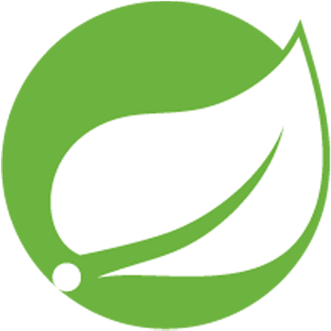
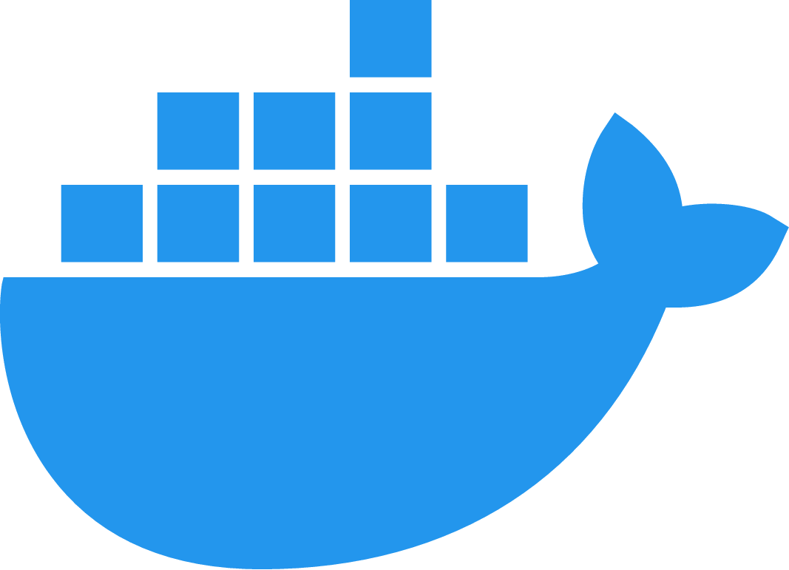

# Greetings to all, I'm Nazar

### About me
I'm a software engineering student in the Igor Sikorskii Kyiv Polytechnic Institute. For now I'm studying in order to achieve the grade of bachelor.

### Languages
 `Ukrainian - Native (C2)`

 `English - Intermediate (B1+)`

### Education

<table border="1">
  <tr>
    <td></td>
    <td><strong>Bachelor, Software Engineering</strong></td>
    <td><strong>Kyiv Polytechnic Institute</strong></td>
    <td>2022-2026(in progress)</td>
  </tr>
</table>

### Technologies where I have a goal to grow
Here are some technologies which I pursue to use as my core technology stack in developing.

| Java                                      | Spring                                  | PostgreSQL                             | NextJS                                  | Docker                                  | Figma                                      | HTML                                      | CSS                                      |
|-------------------------------------------|----------------------------------------|----------------------------------------|-----------------------------------------|-----------------------------------------|-------------------------------------------|-------------------------------------------|-------------------------------------------|
|  |  |  |  |  |  |  |  |

### Projects

Here will be smth soon...

### Work experience
<table border = "0">
  <tr>
    <td></td>
    <td>Deputy Chairman of the Student Council  of Kyiv Polytechnic Institute</td>
    <td>1 year 05.05.2024 - 02.05.2025</td>
  </tr>
  <tr>
    <td></td>
    <td>Python Teacher</td>
    <td>3 months 13.08.2023 - 13.11.2023</td>
  </tr>
  
</table>
