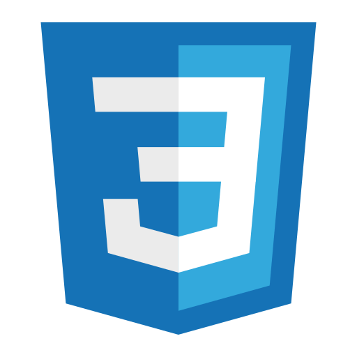

# Greetings to all, I'm Nazar

### About me
I'm a software engineering student in the Igor Sikorskii Kyiv Polytechnic Institute. For now I'm studying in order to achieve the grade of bachelor.

### Languages
 `Ukrainian - Native (C2)`

 `English - Intermediate (B1+)`

### Technologies where I have a goal to grow
Here are some technologies which I pursue to use as my core technology stack in developing.
Here’s the updated table with two new columns for HTML and CSS:

| Java                                      | Spring                                  | PostgreSQL                             | NextJS                                  | Docker                                  | Figma                                      | HTML                                      | CSS                                      |
|-------------------------------------------|----------------------------------------|----------------------------------------|-----------------------------------------|-----------------------------------------|-------------------------------------------|-------------------------------------------|-------------------------------------------|
|  |  |  |  |  |  |  |  |
